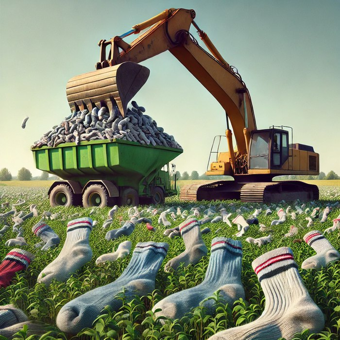

# SocksTank

На базе проекта [Freenove Tank Robot](https://github.com/adw0rd/Freenove_Tank_Robot_Kit_for_Raspberry_Pi) был выдуман проект `SocksTank`, его главная миссия - искать носки по квартире и собирать их в общую кучу, рядом со стиральной машинкой.

Если вы уже собрали проект [Freenove Tank](https://github.com/adw0rd/Freenove_Tank_Robot_Kit_for_Raspberry_Pi), то можно приступить к обучению модели и инференсу на Raspberry Pi. Для этого я пошагово разложил своё скромное руководство:

* **Подготовка Raspberry Pi**
    * [Выбор между RPI4B и RPI5](docs/ru/rpi.md)
    * [Запуск с носителя (sd card, usb flash, hat+ssd)](docs/ru/rpi5.md#storage)
    * [Обновление Raspberry Pi OS (Debian) до deb12u1-u3](docs/ru/rpi5.md#upgrade)
    * [Установка зависимостей](docs/ru/rpi5.md#deps)
    * [Настройка автозапуска](docs/ru/rpi5.md#autostart)
    * [Работа с камерой](docs/ru/rpi5.md#camera)
    * [Разгон Raspberry Pi](docs/ru/rpi5.md#boost)
    * [Охлаждение](docs/ru/rpi5.md#cooling)
    * [Установка ultralytics, pytorch и т.д.](docs/ru/rpi5.md#ultralytics)
* **Подготовака датасета**
    * [Создание коллекции фотографий носков](docs/ru/dataset.md#camera)
    * [Использование Roboflow для аннотаций](docs/ru/dataset.md#roboflow)
    * [Аугментация при помощи imgaug](docs/ru/dataset.md#augmentation)
* **Тренировка модели**
    * [YOLOv8](docs/ru/yolo8.md#train)
    * [YOLOv11](docs/ru/yolo11.md#train)
* **Инференс**
    * [YOLOv8](docs/ru/yolo8.md#inference)
    * [YOLOv11](docs/ru/yolo11.md#inference)
    * [YOLOv11 + ncnn](docs/ru/yolo11.md#ncnn)
