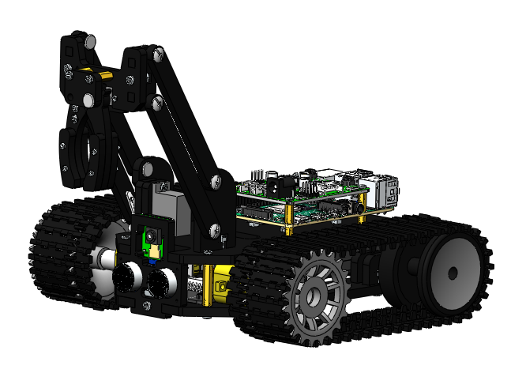

# SocksTank

  
  

**SocksTank** is a Raspberry Pi robot tank that finds socks with [YOLO model inference](docs/en/inference.md), drives from a [browser-based control panel](docs/en/inference.md#web-control-panel-recommended), and can run inference either on-device with NCNN or remotely on a [GPU server](docs/en/inference.md#remote-inference-gpu-server).

Why it stands out:

- runs on [Raspberry Pi 5](docs/en/rpi5.md) with real [benchmarked NCNN performance](docs/en/benchmarks.md)
- includes a [web control panel](docs/en/inference.md#web-control-panel-recommended) with live video, motors, servos, LEDs, and telemetry
- supports both [local inference](docs/en/inference.md#web-control-panel-recommended) and [remote GPU inference](docs/en/inference.md#remote-inference-gpu-server)
- deploys to Raspberry Pi from a single [CLI entrypoint](docs/en/launch.md#recommended-deploy-flow-mainpy-deploy)

Built on top of [Freenove Tank Robot Kit](https://github.com/adw0rd/Freenove_Tank_Robot_Kit_for_Raspberry_Pi) (PCB Version V1.0, but V2.0 is also supported). If you've already assembled the Freenove Tank, it's time for the next step — train your own model and run it on a Raspberry Pi.

Quick start:

1. Set up the hardware: [RPi 5 setup](docs/en/rpi5.md)
2. Prepare a dataset: [dataset guide](docs/en/dataset.md)
3. Train and export the model: [training guide](docs/en/training.md)
4. Launch and deploy the stack: [launch guide](docs/en/launch.md)

Demo:

- Demo video/GIF will be added here after the camera build is completed.

Highlights:

- [Quick start path](docs/en/README.md#quick-start)
- [Run and deploy](docs/en/launch.md)
- [Web control panel and inference modes](docs/en/inference.md)
- [RPi benchmark results](docs/en/benchmarks.md)

## Documentation

### Recommended path

1. [RPi 5 setup (recommended)](docs/en/rpi5.md)
2. [Dataset guide](docs/en/dataset.md)
3. [Training and model export](docs/en/training.md)
4. [Run and deploy](docs/en/launch.md)
5. [Web control panel and inference modes](docs/en/inference.md)

### Build your model

- [Capturing photos](docs/en/dataset.md#capturing-photos)
- [Uploading to Roboflow and annotation](docs/en/dataset.md#uploading-to-roboflow)
- [Augmentation](docs/en/dataset.md#augmentation)
- [Exporting the dataset](docs/en/dataset.md#exporting-the-dataset)
- [Training (GPU, Apple Silicon, CPU)](docs/en/training.md#training)
- [Evaluating results](docs/en/training.md#evaluating-results)
- [Model export (NCNN for RPi)](docs/en/training.md#model-export)

### Run and operate

- [Running the project](docs/en/launch.md)
- [Web control panel](docs/en/inference.md#web-control-panel-recommended)
- [Deploying to RPi](docs/en/inference.md#deploying-to-rpi)
- [Remote GPU inference](docs/en/inference.md#remote-inference-gpu-server)
- [Integration with tank controls](docs/en/inference.md#integration-with-tank-controls)

### Reference

- [RPi 4 setup (legacy)](docs/en/rpi4.md)
- [RPi 5 power supply](docs/en/rpi5-power.md)
- [Inference benchmarks](docs/en/benchmarks.md)
- [Disk benchmarks](docs/en/disk-benchmarks.md)
- [Infrastructure](docs/en/infrastructure.md)

---

**SocksTank** — робот-танк на базе Raspberry Pi, который находит носки с помощью [YOLO-инференса](docs/ru/inference.md), управляется из [веб-панели в браузере](docs/ru/inference.md#веб-панель-управления-рекомендуемый-способ) и может выполнять инференс как локально через NCNN, так и удалённо на [GPU-сервере](docs/ru/inference.md#удалённый-инференс-gpu-сервер).

Чем проект интересен:

- работает на [Raspberry Pi 5](docs/ru/rpi5.md) с реальными [замерами производительности NCNN](docs/ru/benchmarks.md)
- включает [веб-панель управления](docs/ru/inference.md#веб-панель-управления-рекомендуемый-способ) с живым видео, моторами, сервоприводами, LED и телеметрией
- поддерживает как [локальный инференс](docs/ru/inference.md#веб-панель-управления-рекомендуемый-способ), так и [удалённый GPU-инференс](docs/ru/inference.md#удалённый-инференс-gpu-сервер)
- деплоится на Raspberry Pi через единый [CLI entrypoint](docs/ru/launch.md#рекомендуемый-сценарий-деплоя-mainpy-deploy)

Построен поверх [Freenove Tank Robot Kit](https://github.com/adw0rd/Freenove_Tank_Robot_Kit_for_Raspberry_Pi) (PCB Version V1.0, но поддерживается и V2.0). Если вы уже собрали Freenove Tank, самое время перейти к следующему этапу — обучить собственную модель и запустить её на Raspberry Pi.

Быстрый старт:

1. Подготовить железо: [настройка RPi 5](docs/ru/rpi5.md)
2. Подготовить датасет: [гайд по датасету](docs/ru/dataset.md)
3. Обучить и экспортировать модель: [гайд по обучению](docs/ru/training.md)
4. Запустить и задеплоить проект: [гайд по запуску](docs/ru/launch.md)

Демо:

- Здесь появится короткое demo video/GIF после завершения сборки камеры.

Ключевые ссылки:

- [Быстрый старт](docs/ru/README.md#быстрый-старт)
- [Запуск и деплой](docs/ru/launch.md)
- [Веб-панель и режимы инференса](docs/ru/inference.md)
- [Замеры на RPi](docs/ru/benchmarks.md)

## Документация

### Рекомендуемый путь

1. [Настройка RPi 5 (рекомендуется)](docs/ru/rpi5.md)
2. [Гайд по датасету](docs/ru/dataset.md)
3. [Тренировка и экспорт модели](docs/ru/training.md)
4. [Запуск и деплой](docs/ru/launch.md)
5. [Веб-панель и режимы инференса](docs/ru/inference.md)

### Подготовка модели

- [Съёмка фотографий](docs/ru/dataset.md#съёмка-фотографий)
- [Загрузка в Roboflow и аннотирование](docs/ru/dataset.md#загрузка-в-roboflow)
- [Аугментация](docs/ru/dataset.md#аугментация)
- [Экспорт датасета](docs/ru/dataset.md#экспорт-датасета)
- [Тренировка (GPU, Apple Silicon, CPU)](docs/ru/training.md#тренировка)
- [Оценка результатов](docs/ru/training.md#оценка-результатов)
- [Экспорт модели (NCNN для RPi)](docs/ru/training.md#экспорт-модели)

### Запуск и эксплуатация

- [Запуск проекта](docs/ru/launch.md)
- [Веб-панель управления](docs/ru/inference.md#веб-панель-управления-рекомендуемый-способ)
- [Деплой на RPi](docs/ru/inference.md#деплой-на-rpi)
- [Удалённый GPU-инференс](docs/ru/inference.md#удалённый-инференс-gpu-сервер)
- [Интеграция с управлением танком](docs/ru/inference.md#интеграция-с-управлением-танком)

### Справка

- [Настройка RPi 4 (legacy)](docs/ru/rpi4.md)
- [Питание RPi 5](docs/ru/rpi5-power.md)
- [Бенчмарки инференса](docs/ru/benchmarks.md)
- [Бенчмарки диска](docs/ru/disk-benchmarks.md)
- [Инфраструктура](docs/ru/infrastructure.md)

---

## Co-authors

- Mikhail Andreev ([adw0rd](https://github.com/adw0rd))
- Claude Code
- OpenAI Codex
