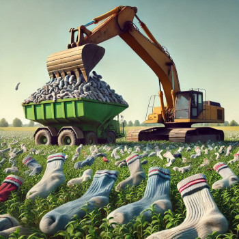

# SocksTank



**SocksTank** is a Raspberry Pi 4B-based robot tank that hunts for socks around the apartment using computer vision (YOLO) and picks them up with a claw. Includes a web control panel with live video and telemetry.

Built on top of [Freenove Tank Robot Kit](https://github.com/adw0rd/Freenove_Tank_Robot_Kit_for_Raspberry_Pi).

<br clear="left">

## What you need

### Hardware

- **Raspberry Pi 4B** (or RPi 5) with power supply and SD card (32 GB+)
- **Freenove Tank Robot Kit** ([GitHub](https://github.com/Freenove/Freenove_Tank_Robot_Kit_for_Raspberry_Pi))
- **ov5647 camera** (OmniVision, included in the Freenove kit)
- **GPU server** for model training (NVIDIA, Apple Silicon, or cloud)

### Software

- Python 3.10+
- [ultralytics](https://github.com/ultralytics/ultralytics) (YOLOv8/v11)
- [Roboflow](https://roboflow.com/) — for dataset annotation (free tier)

## Quick Start

1. **Assemble the tank** — Freenove Tank Robot Kit (instructions included)
2. **Set up RPi** — [rpi4.md (legacy)](rpi4.md)
3. **Collect dataset** — [dataset.md](dataset.md)
4. **Train model** — [training.md](training.md)
5. **Run detection** — [inference.md](inference.md)

## Project structure

```
main.py              # CLI entry point (typer): train, bench, detect, shot, serve
server/              # FastAPI backend (web control panel)
frontend/            # Vite + React + TypeScript (web panel)
models/              # Trained YOLO models
├── yolo8_best.pt    # YOLOv8n (mAP50=0.995, mAP50-95=0.885)
└── yolo11_best.pt   # YOLOv11n (mAP50=0.995, mAP50-95=0.96)
legacy/              # Old scripts (bench, camera_detect, camera_shot, train)
data.yaml            # Dataset config (1 class: sock, Roboflow v2, 961 images)
dataset/             # Private dataset (train/valid/test) [.gitignore]
pyproject.toml       # Project dependencies (uv/pip)
docs/
├── ru/              # Documentation (Russian)
└── en/              # Documentation (English)
assets/              # Project images
```

## CLI commands (main.py)

```bash
# Web control panel (macOS, mock mode)
./main.py serve --mock

# Web control panel (RPi, real hardware)
sudo -E python main.py serve --model models/yolo11_best.pt --conf 0.5

# Train model (on GPU server or dev machine)
./main.py train --device 0 --epochs 100

# Benchmark model
./main.py bench

# Detect socks from RPi camera (legacy)
sudo -E python main.py detect --model models/yolo8_best.pt --conf 0.5

# Capture photos for dataset
sudo -E python main.py shot --count 200 --output-dir images
```

## Installation

```bash
# Dev machine (macOS / Linux)
uv venv && uv pip install typer ultralytics opencv-python-headless numpy fastapi uvicorn pydantic-settings websockets
cd frontend && npm install && npm run build

# Raspberry Pi
sudo pip install fastapi uvicorn pydantic-settings websockets typer --break-system-packages
```

## Documentation

| Section | Description |
|---|---|
| [RPi 4 setup (legacy)](rpi4.md) | OS installation, dependencies, camera, autostart |
| [RPi 5 setup](rpi5.md) | Specifications, power, differences from RPi 4 (legacy) |
| [Dataset preparation](dataset.md) | Photo capture, Roboflow, annotation, augmentation |
| [Model training](training.md) | YOLO training, parameters, evaluation, export |
| [Running on the robot](inference.md) | Web panel, deployment, detection, tank integration |
| [Infrastructure](infrastructure.md) | Hosts, SSH, GPIO, hardware |
