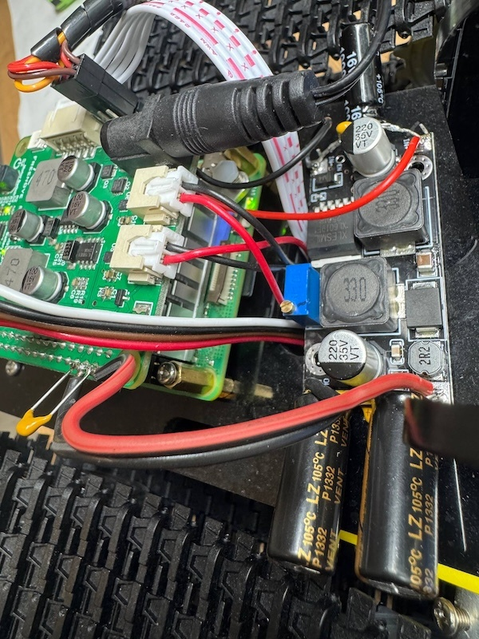
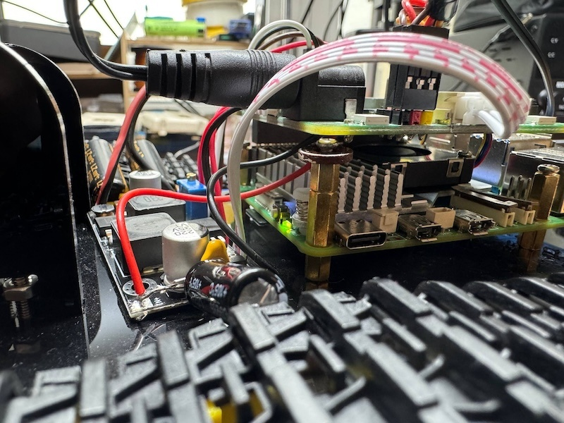

# RPi 5 — Power Supply & Consumption

Measured: 2026-02-25, updated 2026-02-27.

## Problem

RPi 5 (Cortex-A76 2.4 GHz, 8 GB RAM) draws significantly more power than RPi 4. Freenove Tank Board is designed for RPi 3/4 (~2-3A max), its onboard DC/DC converter cannot handle RPi 5 peak consumption.

### Symptoms

- `Undervoltage detected!` in journalctl
- `throttled=0x50005` (bit 0 — current undervoltage, bit 16 — undervoltage occurred)
- Freezes and crashes under peak load (compilation, all 4 cores)
- EXT5V_V drops to 4.73V (normal: 5.0-5.1V)

## Power Consumption (PMIC)

### Idle (compilation on 1 core, taskset -c 0)

| Rail | Current (A) | Voltage (V) | Power (W) |
|---|---|---|---|
| VDD_CORE | 1.63 | 0.72 | 1.17 |
| 0V8_SW | 0.38 | 0.80 | 0.31 |
| 1V1_SYS | 0.18 | 1.10 | 0.20 |
| 1V8_SYS | 0.14 | 1.80 | 0.25 |
| 3V3_SYS | 0.06 | 3.33 | 0.20 |
| 3V7_WL_SW | 0.10 | 3.66 | 0.37 |
| DDR_VDD2 | 0.03 | 1.11 | 0.03 |
| HDMI | 0.03 | 4.85 | 0.13 |
| **EXT5V** | — | **4.86** | — |
| **Total (est.)** | | | **~2.7W** |

### Under Load (C++ OpenCV compilation, 1 core)

| Rail | Current (A) | Voltage (V) | Power (W) |
|---|---|---|---|
| VDD_CORE | **2.61** | 0.86 | **2.24** |
| 0V8_SW | 0.38 | 0.80 | 0.30 |
| 1V1_SYS | 0.18 | 1.10 | 0.20 |
| 1V8_SYS | 0.14 | 1.80 | 0.25 |
| 3V3_SYS | 0.06 | 3.33 | 0.19 |
| 3V7_WL_SW | 0.10 | 3.61 | 0.37 |
| DDR_VDD2 | 0.05 | 1.11 | 0.05 |
| HDMI | 0.03 | 4.73 | 0.13 |
| **EXT5V** | — | **4.73** | — |
| **Total (est.)** | | | **~3.7W** |

> At full load (4 cores) consumption can reach **6-8W** (12W with USB devices).

## Power Sources (Tests)

| Source | EXT5V_V | Result |
|---|---|---|
| Freenove Tank Board (2x18650 via DC/DC) | ~4.8-4.9V | Undervoltage under load, crashes |
| Xiaomi 120W USB-C charger | 4.73-4.86V | Undervoltage (no PD negotiation, ~5V/2-3A) |
| Phone 3A USB-C charger | ~4.8V | Undervoltage |
| Official RPi 5 PSU (27W USB PD) | 5.0-5.1V | ✅ Recommended |

## Solution: XL6019E1 DC-DC Buck-Boost Converter ✅

**XL6019E1** (5A, buck-boost) — recommended converter for RPi 5.

### Wiring

```
Batteries (2x18650, 7.4V) → XL6019E1 (5.2V) → RPi 5 GPIO (Pin 2 = 5V, Pin 6 = GND)
```

### XL6019E1 Specs

- Input: 5-32V (suitable for 2S LiPo 6.4-8.4V)
- Output: adjustable, set to **5.2V** (potentiometer)
- Max current: **5A** (sufficient for RPi 5 on 4 cores)
- Type: buck-boost (step-up/step-down)

### Capacitors (Recommended)

To stabilize current spikes during RPi 5 boot:

Electrolytic:
- **Input** (battery side): 1000-2200µF 16V
- **Output** (5.2V side): 2200µF 10V

Ceramic 100nF (parallel to electrolytics, HF noise filtering):
- **Input** of XL6019E1
- **Output** of XL6019E1
- **GPIO pins 2, 4 (5V) and 6 (GND)** on RPi 5





#### Results Before and After Capacitors

| Parameter | Before | After |
|---|---|---|
| EXT5V_V (idle) | 5.220V | 5.226V |
| EXT5V_V (4 cores) | 5.22-5.23V | 5.22-5.23V |
| Cold start (4 cores, no gradual warmup) | ❌ crash | ✅ stable |

> Capacitors smooth out current surges during cold boot and load switching. Without them, direct 4-core startup crashed rpi5 (peak current >5A).

### Converter Comparison

| Converter | Type | Rated | Output | 1 core | 2 cores | 3 cores | 4 cores |
|---|---|---|---|---|---|---|---|
| LM2596 | buck | 3A | 5.1V | ✅ 7.7 FPS | ✅ 11.1 FPS | ❌ crash | ❌ crash |
| **XL6019E1** | buck-boost | **5A** | 5.2V | ✅ | ✅ | ✅ | ✅ (gradual start) |

> LM2596 (3A) cannot handle 3+ cores — current exceeds rated. XL6019E1 (5A) — recommended.

### Recommendations

1. Set output to **5.2V** (verify with multimeter before connecting)
2. Connect via GPIO Pin 2 (5V) and Pin 6 (GND)
3. Solder capacitors (input + output)
4. Use **[gradual startup](#gradual-startup-cpu-warmup)** when loading model (1→2→3→4 cores)
5. Verify: `vcgencmd pmic_read_adc | grep EXT5V` → >5.0V
6. Maximum allowed RPi 5 voltage: **5.5V** (recommended 5.0-5.25V)

> ⚠️ **Depleted 18650 batteries** (total <6.5V) cause boot crash-loop. Check battery voltage with multimeter!

## Gradual Startup (CPU warmup)

On RPi 5, loading all 4 cores instantly causes a peak current spike that can crash the system (especially on battery power). The `server/cpu_warmup.py` module solves this with staged warmup:

1. Run inference on **1 core** (via `os.sched_setaffinity`)
2. Pause 2 sec → switch to **2 cores**
3. Pause 2 sec → **3 cores**
4. Pause 2 sec → **4 cores**

Each stage runs several inference iterations on a dummy frame. After completion, affinity is restored to all cores.

Settings in `server/config.py`:
```
cpu_warmup: bool = True           # Enable gradual startup
cpu_warmup_stages: str = "1,2,3,4"  # Stages (number of cores)
cpu_warmup_samples: int = 3       # Iterations per stage
cpu_warmup_pause_s: float = 2.0   # Pause between stages (seconds)
```

Enabled automatically on `serve` (except `--mock` mode).

## config.txt Power Settings

```
# /boot/firmware/config.txt
usb_max_current_enable=1
psu_max_current=5000
```

These parameters allow RPi to draw up to 5A via GPIO/USB.

## Workaround (Temporary)

If XL6019E1 is unavailable, limit the load:
```bash
# Limit to 1-2 cores (safe for LM2596 3A)
taskset -c 0,1 python3 main.py serve ...
```
