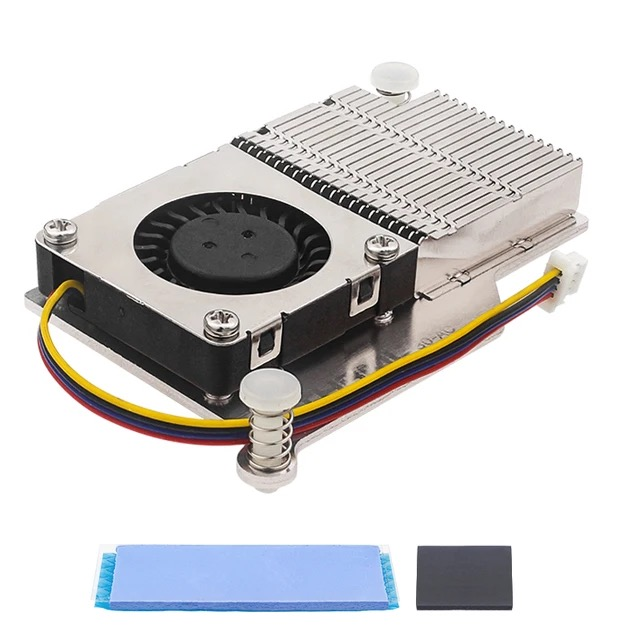
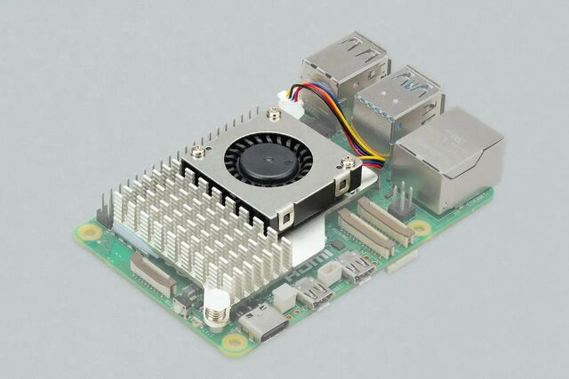
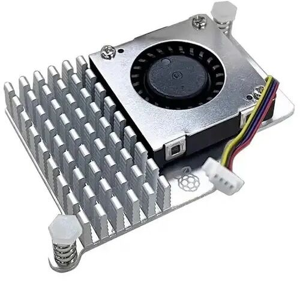
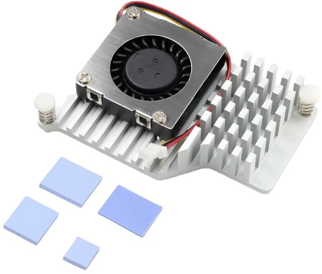

# Raspberry Pi 5 Setup

Guide for preparing RPi 5 for the SocksTank robot.

## Specifications

| Parameter | Value |
|---|---|
| Model | Raspberry Pi 5 Model B Rev 1.0 |
| SoC | BCM2712 (Cortex-A76) |
| CPU | 4 cores, 1.5-2.4 GHz |
| RAM | 8 GB |
| OS | Debian GNU/Linux 13 (trixie) **64-bit** |
| Kernel | 6.12.62+rpt-rpi-2712 aarch64 |
| Python | 3.13.5 (aarch64 **64-bit**) |
| Disk | microSD 117 GB |
| Revision | d04170 |
| IP | 192.168.0.158 (DHCP, hostname rpi5) |

## Differences from RPi 4 (legacy)

| | RPi 4 Model B | RPi 5 Model B |
|---|---|---|
| CPU | Cortex-A72 1.8 GHz | Cortex-A76 2.4 GHz |
| RAM | 3.3 GB | 8 GB |
| OS | Debian 12 bookworm 64-bit | Debian 13 trixie 64-bit |
| Python | 3.11.2 (aarch64) | 3.13.5 (aarch64) |
| PyTorch | ✅ 2.8.0+cpu | ✅ 2.10.0+cpu |
| onnxruntime | ✅ 1.24.2 | ✅ 1.24.2 |
| ncnn | ✅ | ✅ 1.0.20260114 |
| Power | 5V/3A (USB-C) | **5V/5A** (USB PD) |
| pigpiod | Required | Not required |
| Camera | cam0 (15-pin CSI) | cam0 or cam1 (22-pin FPC) |
| Disk (write) | 60.7 MB/s (USB SanDisk) | 64.3 MB/s (microSD) |
| Disk (read) | 151 MB/s (USB SanDisk) | 90.6 MB/s (microSD) |
| YOLO FPS (NCNN) | 2.4 FPS (1 thread) | **14.9 FPS** (4 OMP threads, with preproc) |

## Power

RPi 5 draws significantly more power than RPi 4. The Freenove Tank Board DC/DC converter is insufficient.

Solution: **XL6019E1** buck-boost converter (2x18650 → 5.2V → GPIO) + capacitors + [gradual startup](rpi5-power.md#gradual-startup-cpu-warmup).

Detailed measurements, converter comparison, wiring and recommendations: **[rpi5-power.md](rpi5-power.md)**

## Cooling

Recommended: **RPi 5 Active Cooler** — aluminum heatsink with PWM fan, connects to the FAN header on RPi 5 board. Fan speed is controlled automatically based on temperature.

Temperature under load (YOLO inference, 4 cores): 38→47°C (XL6019E1), 37→60°C (LM2596). Throttled=0x0.

The original has a Raspberry Pi logo, clones are functionally identical.

Alternative: **Argon THRML 30 mm** style blower cooler for Raspberry Pi 5. It is more compact and can be useful when vertical clearance is limited inside a chassis. This is not the default recommendation yet, but it looks like a practical low-profile option to test.









Where to buy:
- AliExpress: [example](https://ali.click/b7k211d). Search: «Raspberry Pi 5 active cooler» or «RPi 5 heatsink fan PWM»
- Ozon (Russia): [original](https://ozon.ru/t/6dwBhuE), [cooler](https://ozon.ru/t/hoNZF6l), [clone 1](https://ozon.ru/t/hoNZFqO), [clone 2](https://ozon.ru/t/6dwBNmn)
- Ozon (Russia, low-profile alternative): [Argon THRML 30 mm style cooler](https://ozon.ru/t/DukWou1)
- AliExpress (low-profile alternative): [Argon THRML 30 mm style cooler](https://ali.click/uae311m)

## OS Installation

Use **Raspberry Pi OS Lite (64-bit)** via Raspberry Pi Imager:
- OS: Raspberry Pi OS (other) → Raspberry Pi OS Lite (64-bit)
- Hostname: rpi5
- Username: zeus
- Wi-Fi + SSH: enable

## Network

Uses **DHCP** (ipv4.method: auto) + hostname `rpi5`. Static IP is not needed — access via hostname through mDNS (avahi):

```bash
ssh rpi5            # instead of ssh 192.168.0.xxx
http://rpi5:8080    # web panel
```

If mDNS doesn't work (Windows without Bonjour, or a different network), you can set a static IP:

```bash
sudo nmcli con modify "netplan-wlan0-YOUR_SSID" ipv4.addresses 192.168.0.158/24
sudo nmcli con modify "netplan-wlan0-YOUR_SSID" ipv4.gateway 192.168.0.1
sudo nmcli con modify "netplan-wlan0-YOUR_SSID" ipv4.dns "8.8.8.8"
sudo nmcli con modify "netplan-wlan0-YOUR_SSID" ipv4.method manual
sudo nmcli con up "netplan-wlan0-YOUR_SSID"
```

## Installed Packages

```
Python 3.13.5 (aarch64 64-bit)
torch 2.10.0+cpu
torchvision 0.25.0
ultralytics 8.4.16
cv2 4.13.0 (opencv-python-headless)
numpy 2.4.2
ncnn 1.0.20260114
onnxruntime 1.24.2
matplotlib 3.10.8
scipy 1.17.1
polars 1.38.1
```

## config.txt

File: `/boot/firmware/config.txt`

Added parameters for SocksTank:

```ini
# PWM for Freenove Tank Board servos
dtoverlay=pwm-2chan,pin=12,func=4,pin2=13,func2=4

# OV5647 camera
dtoverlay=ov5647

# Power via GPIO from Freenove Tank Board
usb_max_current_enable=1
psu_max_current=5000
```

Full config: [../rpi5-config.txt](../rpi5-config.txt)

### Differences from RPi 4 (legacy)

- **pigpiod** is not needed on RPi 5 (uses built-in GPIO)
- **Camera**: RPi 5 has cam0/cam1 connectors with 22-pin FPC (not 15-pin CSI like RPi 4). A [22→15 pin cable](https://ozon.ru/t/lwESi2D) or [22-to-15 adapter](https://ozon.ru/t/EAxTi6d) is needed. On AliExpress search: «Raspberry Pi 5 camera cable 22pin to 15pin» or «RPi 5 CSI FPC adapter 22 15».
- **LED (PCB v1)**: the onboard RGB LEDs are not supported on RPi 5 with the original PCB v1 board. `rpi_ws281x` is not compatible there, so the LED controls are intentionally disabled in the UI. On RPi 4 the LEDs work, and on PCB v2 they work via SPI.

## Benchmarks

Key numbers (YOLOv11n, pip ncnn native + OMP workaround):

| Configuration | FPS | vs RPi 4 |
|---|---|---|
| 4 OMP threads (pure inference) | **15.8** | 14.4x |
| 4 OMP threads (with preproc) | **14.9** | 13.5x |
| XL6019E1, 4 cores (battery) | **11.2** | 10.2x |
| LM2596, 2 cores (battery) | **11.1** | 10.1x |

Disk: write 73.5 MB/s, read 94.5 MB/s (microSD).

Detailed measurements for all formats, power sources, INT8 and temperatures: **[benchmarks.md](benchmarks.md)**, **[disk-benchmarks.md](disk-benchmarks.md)**
